# Notice
- This guide only applies if you're using the jupyterhub server of Diamond Light Source (DLS)
- __The instruction here focuses mainly on data processing and analysis of scanning electron nannodiffraction (SEND) or nanobeam electron diffraction (NBD or NBED) four-dimensional scanning transmission electron microscopy (4DSTEM) data__
- __The notebooks will submit jobs to DLS cluster nodes for data processing, so users must complete the ssh key setting__
- The ipython notebooks or Python scripts should be modified if you want to perform them on your computer system
- This workflow has been optimised for the Python kernel of 'epsic3.10'  
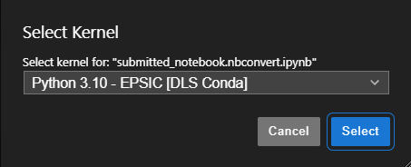
- [Instructions to connect to Diamond's JupyterHub](https://diamondlightsource.atlassian.net/wiki/spaces/EPSICWEB/pages/167346199/Instructions+to+connect+to+Diamond+s+JupyterHub)
- This guide only deals with data acquired using E02 (Grand ARM300CF; JEOL, MerlinEM; Quantum Detectors, Aztec; Oxford Instruments)
- Please refer to the following article to see what you can do with 4DSTEM: [py4DSTEM: A Software Package for Four-Dimensional Scanning Transmission Electron Microscopy Data Analysis](https://dx.doi.org/10.1017/S1431927621000477)
- [py4DSTEM](https://github.com/py4dstem/py4DSTEM) and [pyxem](https://github.com/pyxem/pyxem?tab=readme-ov-file) are very useful generally for 4DSTEM data processing and analysis
- Please contact Jinseok Ryu, PhD (jinseok.ryu@diamond.ac.uk) if you have any questions about this workflow

# MIB conversion
- The format of raw 4DSTEM data is '.mib'
- mib files must be converted into the 'hdf5' files using 'MIB_conversion/MIB_convert.ipynb'
- The codes for MIB conversion can be found in [epsic_tools - MIB_convert_widget](https://github.com/ePSIC-DLS/epsic_tools/tree/master/epsic_tools/mib2hdfConvert/MIB_convert_widget/scripts)
- hdf5 files can be read using 'H5PY' or 'HyperSpy' ([Example](https://github.com/jinseuk56/User-Notebooks/blob/master/ePSIC_Standard_Notebooks/automatic_Au_xgrating_calibration/au_xgrating_cal_submit.ipynb))
- Details can be found inside the notebook (Do not use GPU nodes for no reason)  
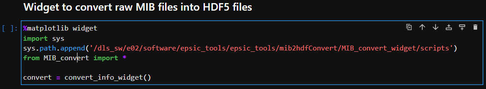
- Currently, when 4DSTEM data is acquired simultaneously with EDX, the scan shape must be manually specified using 'known_shape' widget (make sure that 'Use Fly-back' is unchecked in this case) - the scan shape must be (Scan_X, Scan_Y) = (Scan_X, Scan_X-1)
- But, in most cases, 'Auto reshape' will determine the scan shape automatically, so you don't have to use other options for reshaping
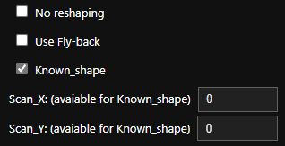
- The necessary options to specify are normally:  
    - 'Year'
    - 'Session'
    - 'Subfolder' or 'All MIB files in 'Merlin' folder'
    - 'Auto reshape' (optionally 'Use Fly-back' or 'Known_shape' and enter the scan shape)
    - 'Create slurm batch file'
    - 'Create conversion info file'
    - 'Submit a slurm job'
# Obtaining the calibration information using the Au reference data
- (27/08/2025 update) This can be done using the MIB conversion notebook
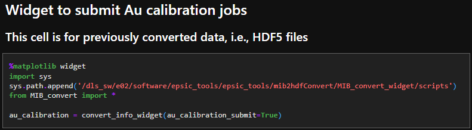
- The reciprocal pixel size of scanning electron nanodiffraction (SEND) data (4DSTEM data acquired using a pencil beam) should be retrieved from Au reference data
- The ellipticity of diffraction rings should also be calculated
- By running 'automatic_Au_xgrating_calibration/Load_change_submit_array_calibration.ipynb', the calibration information json file will be produced for each reference data  
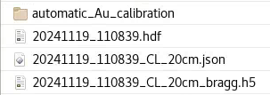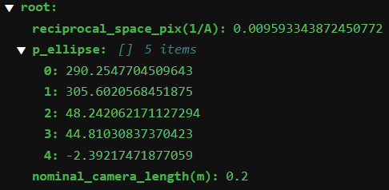
- Please visit the following page for the details of this process: [py4DSTEM - Au calibration](https://github.com/ePSIC-DLS/Hyperspy_Workshop_2024/blob/main/py4DSTEM/orientation_01_AuAgPd_wire.ipynb)
- The names of the session and the subfolder should be manually entered
- After this process has been finished, it is recommended checking the quality of the process by looking inside the notebook ('submitted_notebook.nbconvert.ipynb') stored in the directory where the data is stored
- If the result of detecting a diffraction ring does not look accurate, try again after changing the value of 'q_range' or 'pixel_size_inv_Ang' in 'au_xgrating_cal_submit.ipynb'
- Or you can manually run 'submitted_notebook.nbconvert.ipynb' for each calibration data to test a different 'q_range' or 'pixel_size_inv_Ang'  
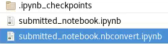
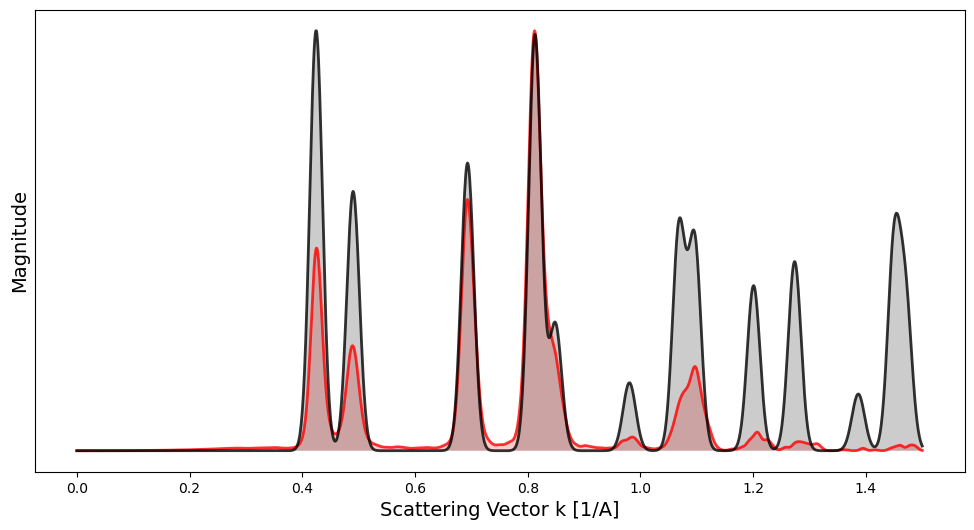
*Check the calibration quality (comparison between the flattened data and the simulated XRD of gold)*
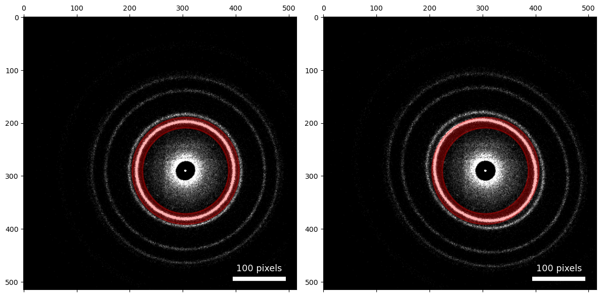
*Check the ellipticity calculation (left: ellipticity-corrected, right: original)*
# Transforming the SEND data into the radial (azimuthal) average/variance profile data
- (27/08/2025 update) This can be done using the MIB conversion notebook
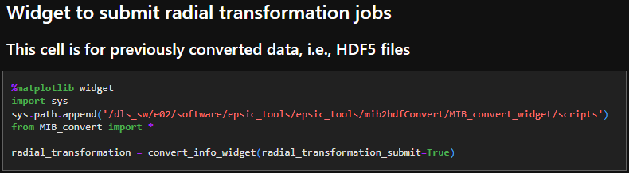
- For this, the above processes should be completed (the calibration information will be automatically applied according to the acceleration voltage and camera length)
- This will flatten each 2D diffraction pattern to a 1D radial average/variance profile
- The exact path of 'automatic_azimuthal_transformation/apply_elliptical_correction_polardatacube.py' should be indicated in 'automatic_azimuthal_transformation/submit_polar_transform_multiple_jobs.ipynb'
- '_azimuthal_mean.hspy' -> average profile 3D data, '_azimuthal_var.hspy' -> variance profile 3D data, '_corrected_scaled.hspy' -> ellpticity-corrected 4DSTEM data  
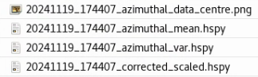
- Please visit the following page for the details of this process: [py4DSTEM - polar transform](https://github.com/py4dstem/py4DSTEM/blob/dev/py4DSTEM/process/polar/polar_analysis.py)
- This process may be helpful for structure characterisation of amorphous/polycrystalline/mixed-phase materials
# Data analysis for radial profile datasets
- The exact path of 'radial_profile_analysis/radial_profile_analysis.py' should be indicated in 'radial_profile_analysis/Run_radial_profile_analysis.ipynb'
- One or many radial profile datasets can be loaded, and the sum of radial profiles can be seen for each 3D data
- The feature extraction and classification of radially flattened profiles can be achieved using a dimensionality reduction method - non-negative matrix factorisation (NMF)
- The EDX spectrum images acquired simultaneously with the SEND data can be also loaded and analysed by correlating with the data analysis result of radial profile datasets
- For details on the simultaneous acquisition of 4DSTEM-EDX, please see this [manual](https://github.com/jinseuk56/User-Notebooks/blob/master/ePSIC_Standard_Notebooks/20250320_4DSTEM-EDX_Manual.pdf)  
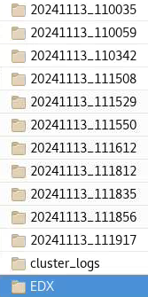 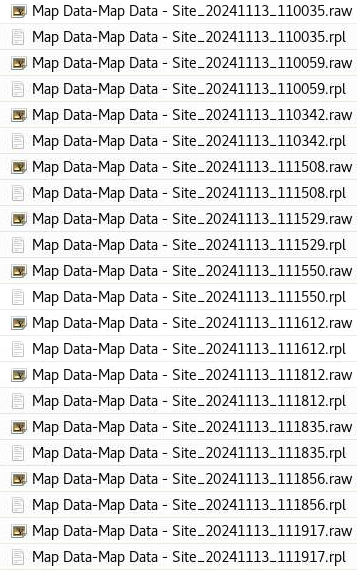  
*The EDX data should be stored as shown in the images above*
- Details can be found inside the notebook
